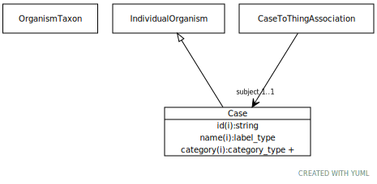

# Type: case

An individual organism that has a patient role in some clinical context.

URI: [biolink:Case](https://w3id.org/biolink/vocab/Case)

## Parents

 *  is_a: [IndividualOrganism](IndividualOrganism.md)

## Referenced by class

 *  **[CaseToThingAssociation](CaseToThingAssociation.md)** *[case to thing association➞subject](case_to_thing_association_subject.md)*  REQ  **[Case](Case.md)**

## Attributes

### Inherited from individual organism:

 * [category](category.md)  1..*
    * Description: Name of the high level ontology class in which this entity is categorized. Corresponds to the label for the biolink entity type class. In a neo4j database this MAY correspond to the neo4j label tag
    * range: [IriType](types/IriType.md)
    * in subsets: (translator_minimal)
 * [id](id.md)  REQ
    * Description: A unique identifier for a thing. Must be either a CURIE shorthand for a URI or a complete URI
    * range: [IdentifierType](types/IdentifierType.md)
    * in subsets: (translator_minimal)
 * [name](name.md)  REQ
    * Description: A human-readable name for a thing
    * range: [LabelType](types/LabelType.md)
    * in subsets: (translator_minimal)

## Other properties

|  |  |  |
| --- | --- | --- |
| **Aliases:** | | patient |
|  | | proband |

