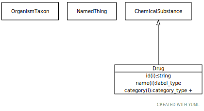

# Type: drug

A substance intended for use in the diagnosis, cure, mitigation, treatment, or prevention of disease

URI: [biolink:Drug](https://w3id.org/biolink/vocab/Drug)

## Parents

 *  is_a: [ChemicalSubstance](ChemicalSubstance.md) - May be a chemical entity or a formulation with a chemical entity as active ingredient, or a complex material with multiple chemical entities as part

## Referenced by class

 *  **[NamedThing](NamedThing.md)** *[has drug](has_drug.md)*  OPT  **[Drug](Drug.md)**

## Attributes

### Inherited from named thing:

 * [id](id.md)  REQ
    * Description: A unique identifier for a thing. Must be either a CURIE shorthand for a URI or a complete URI
    * range: [IdentifierType](types/IdentifierType.md)
    * inherited from: [NamedThing](NamedThing.md)
    * in subsets: (translator_minimal)
 * [name](name.md)  REQ
    * Description: A human-readable name for a thing
    * range: [LabelType](types/LabelType.md)
    * inherited from: [NamedThing](NamedThing.md)
    * in subsets: (translator_minimal)
 * [category](category.md)  1..*
    * Description: Name of the high level ontology class in which this entity is categorized. Corresponds to the label for the biolink entity type class. In a neo4j database this MAY correspond to the neo4j label tag
    * range: [IriType](types/IriType.md)
    * inherited from: [NamedThing](NamedThing.md)
    * in subsets: (translator_minimal)

### Inherited from thing with taxon:

 * [in taxon](in_taxon.md)  0..*
    * Description: connects a thing to a class representing a taxon
    * range: [OrganismTaxon](OrganismTaxon.md)
    * inherited from: [ThingWithTaxon](ThingWithTaxon.md)
    * in subsets: (translator_minimal)

## Other properties

|  |  |  |
| --- | --- | --- |
| **Mappings:** | | WD:Q12140 |
|  | | CHEBI:23888 |
|  | | UMLSSC:T200 |
|  | | UMLSST:clnd |
| **Comments:** | | The CHEBI ID represents a role rather than a substance |

