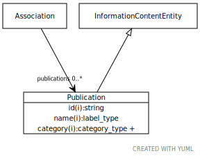

# Type: publication

Any published piece of information. Can refer to a whole publication, or to a part of it (e.g. a figure, figure legend, or section highlighted by NLP). The scope is intended to be general and include information published on the web as well as journals.

URI: [biolink:Publication](https://w3id.org/biolink/vocab/Publication)

## Parents

 *  is_a: [InformationContentEntity](InformationContentEntity.md) - a piece of information that typically describes some piece of biology or is used as support.

## Referenced by class

 *  **[Association](Association.md)** *[publications](publications.md)*  0..*  **[Publication](Publication.md)**

## Attributes

### Inherited from named thing:

 * [id](id.md)  REQ
    * Description: A unique identifier for a thing. Must be either a CURIE shorthand for a URI or a complete URI
    * range: [IdentifierType](types/IdentifierType.md)
    * inherited from: [NamedThing](NamedThing.md)
    * in subsets: (translator_minimal)
 * [name](name.md)  REQ
    * Description: A human-readable name for a thing
    * range: [LabelType](types/LabelType.md)
    * inherited from: [NamedThing](NamedThing.md)
    * in subsets: (translator_minimal)
 * [category](category.md)  1..*
    * Description: Name of the high level ontology class in which this entity is categorized. Corresponds to the label for the biolink entity type class. In a neo4j database this MAY correspond to the neo4j label tag
    * range: [IriType](types/IriType.md)
    * inherited from: [NamedThing](NamedThing.md)
    * in subsets: (translator_minimal)

## Other properties

|  |  |  |
| --- | --- | --- |
| **Aliases:** | | reference |
| **Mappings:** | | IAO:0000311 |
|  | | UMLSSC:T170 |
|  | | UMLSST:inpr |

